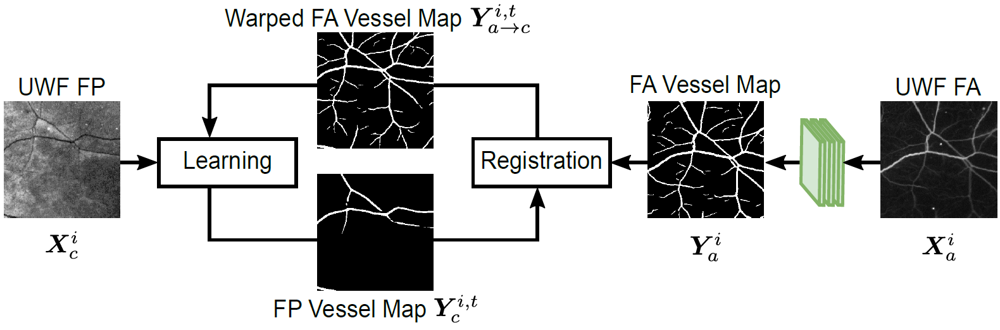

# DeepVesselSeg4FP
This repository contains code for evaluating the retinal vessel segmentation and replicating results from the associated paper:

Li Ding, Ajay E. Kuriyan, Rajeev S. Ramchandran, Charles C. Wykoff, and Gaurav Sharma,
"Weakly-Supervised Vessel Detection in Ultra-Widefield Fundus Photography Via Iterative Multi-Modal Registration and Learning",
IEEE Transactions on Medical Imaging, 2020, accepted for publication, to appear.


<p align="justify">
<a href="http://www.ece.rochester.edu/~gsharma/papers/Ding_IterVDRegUWFFP_TMI2020.pdf">[Paper]</a>
<a href="http://www.ece.rochester.edu/~gsharma/papers/Suppl_Ding_IterVDRegUWFFP_TMI2020.pdf">[Supplementary]</a>
<a href="https://doi.org/10.21227/ctgj-1367">[Dataset]</a>
<a href="https://doi.org/10.24433/">[Code Ocean capsule]</a>
<a href="https://labsites.rochester.edu/gsharma/research/computer-vision/">[Project Website]</a>
</p>

<p align="center">

</p>

## Dependencies
The program requires Python 3.x and the following packages:
* PyTorch v0.4.1
* torchvision v0.2.1
* OpenCV-Python 
* NumPy
* scikit-learn
* scikit-image
* Pillow
* Segmentation-models-pytorch

For specifc package version etc, please see the Code Ocean capsule. GPU is highly recommended.

## Run the Program using Code Ocean
We recommend using the Code Ocean version of this program, which can be run using Code Ocean's built-in interface. The code is available [here](https://doi.org/10.24433/). To use the code independently, without using the Code Ocean platform, you can either download a compute capsule from Code Ocean or get the code from GitHub and complete required manual steps of getting the pre-trained model from Code Ocean and any configuration/API adjustments caused by differences in package versions.

## Detect Retinal Vessels using the provided Pre-trained Model
To run the vessel detection in ultra-widefield fundus photography the pre-trained model, go to `./code` folder and execute the bash script
```bash
./run_detect_FP_vessels_w_DNN.sh
```
The results will be saved to `./results`. This folder will be automatically generated if it does not exist. Please see the comments in `run_detect_FP_vessels_w_DNN.sh` for parameter settings. The detected retinal vessel maps are saved as PNG images in `./results`.

By default, the code demonstrate the vessel detection on three sample images `ImgFP10_PRIME-FP20.tif`, `ImgFP11_PRIME-FP20.tif`, and `ImgFP12_PRIME-FP20.tif` in `./data/datasets/sample_images_from_PRIME-FP20/Images_FP_PRIME-FP20`. The predicted vessel maps are stored in `./results`. The trained model used for obtaining the segmentation is provided as `./data/pretrained_models/model_4.pth` and corresponds to the model used for generating the results for these images for Table 2 of the above paper. That is, it is the model from the 5-fold cross-validation procedure that was trained on the other 12 images in the PRIME-FP20 dataset (see paper for details).

## Evaluate Detected Vessel Maps

Once the vessel detection is completed using the above process, several evaluation metrics (see paper for details) can be computed for the detected vessel maps by comparing the detected vessel maps against provided ground-truth vessel labels. In order to perform the evaluation, go to `./code` folder and execute the bash script
```bash
./run_eval_seg_vs_gt.sh
```
The filename `predicted_ImgFP*png` against the corresponding ground truth vessel map available in the folder `./dataset` where the name of the ground truth file is `LabelFP*.png`.
Summary statistics from the evaluation will be displayed on the screen. By default, if you perform these two steps in sequence, the code will perform the evaluation for the predicted vessel map `Predicted_ImgFP10_PRIME-FP20.png`, `Predicted_ImgFP11_PRIME-FP20.png`, and `Predicted_ImgFP12_PRIME-FP20.png` in `./results` folder using the corresponding ground-truth labeled images in `./data/datasets/sample_images_from_PRIME-FP20/Labels_FP_PRIME-FP20`.


If the full PRIME-FP20 dataset is downloaded in the dataset folder (see following section for instructions), with a minor modification, the evaluation script (and detected vessel maps provided with the code) also allow you to replicate the results reported in Table 2 of the paper. Please see the comments in `run_eval_seg_vs_gt.sh` for parameter settings and the minor changes required. Note that the results in Table 2 of the paper are obtained with a 5-fold cross-validation procedure and to allow replication of the results in the table, we provide the full set of the detected vessel maps obtained using the 5-fold cross-validation in `./data/pretrained_results/`. 

## Datasets
As indicated above, by default, the code runs on three sample ultra-widefield fundus photography images from the PRIME-FP20 dataset that is included with the code repository. If you would like to run the code on all images in the PRIME-FP20 dataset, please download the entire dataset from the [IEEE DataPort](https://doi.org/10.21227/ctgj-1367) and place them in an appropriate directory structure as indicated by the instructions in the file `./data/datasets/README.md`.


## Citation
If you use the code or the RECOVERY-FA19 dataset, please cite:
```BibTex
@ARTICLE{Ding_2020_TMI_DeepVesselSeg4FP,
author={L. Ding and A. E. Kuriyan and R. S. Ramchandran and C. C. Wykoff and G. Sharma},
journal={IEEE Transactions on Medical Imaging}, 
title={Weakly-Supervised Vessel Detection in Ultra-Widefield Fundus Photography Via Iterative Multi-Modal Registration and Learning},
year={2020},
doi={10.1109/TMI.2020.3027665},
note={accepted for publication, to appear},
}
